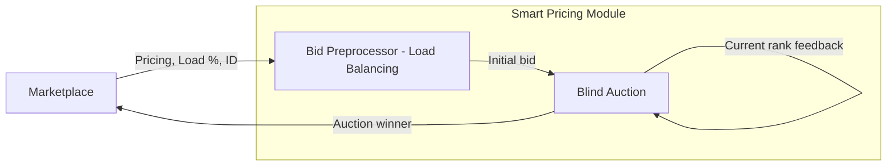

# 🏆 NANCY Smart Pricing Module


**SPM** implements a reverse auction environment using the PettingZoo library and trains agents using Ray RLlib. The environment simulates a reverse auction where multiple agents compete by submitting bids, with the goal of offering the lowest price while maintaining a profitable position.

---

## 💡 System Overview
The SPM gets an API call containing different MNOs and services. It assigns an RL agent to each MNO-services tuple and lets them compete in a multiround blind reverse auction game. The winner is the agent offering the service at the lowest price in the final auction round. The agents are trained via selfplay and try to winn the auction wile keeping their bids in a pre-specified range and maximising their profit.

---

## 🏗️ Architecture
- The **Marketplace** sends request data (pricing context, load, ID).
- The **Bid Preprocessor**:
  - Assigns and prepares bids (load balancing across agents).
- The **Blind Auction**:
  - Multiple RL agents (each representing an MNO-service pair) submit bids without seeing others.
  - Agents iteratively adjust bids based on **ranking feedback**.
- The system runs **multi-round reverse auctions**, where:
  - The **lowest bid wins**, but agents aim to **maximize profit**, not just minimize price.
- The **winner is returned to the Marketplace**.

### High-Level Architecture Diagram


---

## 🛠️ Technical Stack

* Backend:   with **FastAPI**
* RL agents: **Ray RL-lib**
* RL env: **pettingzoo** and **gymnasium** 

---

## 🚀 Deployment

- docker 8000 port publicly exposed here https://nancy-smart-pricing.8bellsresearch.com/
- dont forget to install the required packages:
    ```bash
    
    pip install -r requirements.txt
    
    ```
- example api request
    ```bash
    curl -X POST http://localhost:8000/price_calculation \
      -H "Content-Type: application/json" \
      -d '{
        "services": [
          {
            "provider_id": "provider_1",
            "minprice": 100.0,
            "maxprice": 200.0,
            "availability": 0.9,
            "service_id": "service_a"
          },
          {
            "provider_id": "provider_2",
            "minprice": 150.0,
            "maxprice": 300.0,
            "availability": 0.7,
            "service_id": "service_b"
          }
        ]
      }'
    ```
### Training

Initiate the training process:

```bash

python  main.py  --mode  train

```

This command launches the PPO algorithm to train your agents. The trained model will be saved in the `models` directory.

### Evaluation

Evaluate your trained agents:

```bash

python  main.py  --mode  evaluate

```

This loads the most recent model and runs evaluation episodes, printing results to the console.

### Pretrained Model
A pretrained PPO model is included for immediate evaluation or fine-tuning in `models/`.

To retrain from scratch or fine-tune, modify config.yml or pass CLI arguments as needed.


---

## 🤝 Development & Contribution
We welcome contributions from everyone! You can help by opening issues, suggesting features, improving documentation, or submitting pull requests. Please follow standard open-source practices: fork the repository, create a feature branch, write clear commit messages, and ensure your code is tested and well-documented. For major changes, open an issue first to discuss your proposal. Be respectful in discussions and follow the project’s coding style and contribution guidelines.

For inquiries, please reach out to [ilias.theodoropoulos@8bellsresearch.com](ilias.theodoropoulos@8bellsresearch.com) or [stratos.vamvourelis@8bellsresearch.com](stratos.vamvourelis@8bellsresearch.com).

## 📄 License
This project is licensed under the GNU General Public License v3.0 `license.txt`.
